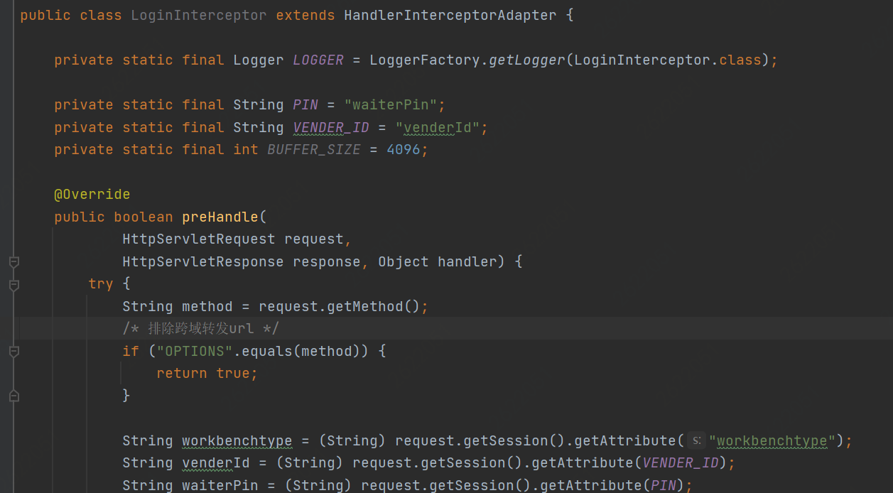

# Day by day

#### 0210

* 架构设计/OOD
  [link](https://segmentfault.com/a/1190000023122582)

#### 0216

* 幂等服务
  以SQL为例，有下面三种场景，只有第三种场景需要开发人员使用其他策略保证幂等性：
  1、 SELECT col1 FROM tab1 WHER col2=2，无论执行多少次都不会改变状态，是天然的幂等。
  2、 UPDATE tab1 SET col1=1WHERE col2=2，无论执行成功多少次状态都是一致的，因此也是幂等操作。
  3、 UPDATE tab1 SET col1=col1+1WHERE col2=2，每次执行的结果都会发生变化，这种不是幂等的。
  [link](https://cloud.tencent.com/developer/article/1522973)

#### 0217

* java双亲委派
所谓的双亲委派机制，指的就是：当一个类加载器收到了类加载的请求的时候，他不会直接去加载指定的类，而是把这个请求委托给自己的父加载器去加载。只有父加载器无法加载这个类的时候，才会由当前这个加载器来负责类的加载。
* java8的新特性
|特性|内容|
|:-|:-|
|[Lambda 表达式](https://www.runoob.com/java/java8-lambda-expressions.html)|Lambda 允许把函数作为一个方法的参数（函数作为参数传递进方法中）。|
|[方法引用](https://www.runoob.com/java/java8-method-references.html)|方法引用通过方法的名字来指向一个方法。方法引用使用一对冒号 :: 。|
|[函数式接口](https://www.runoob.com/java/java8-functional-interfaces.html)|函数式接口(Functional Interface)就是一个有且仅有一个抽象方法，但是可以有多个非抽象方法的接口。函数式接口可以被隐式转换为 lambda 表达式。|
|[默认方法](https://www.runoob.com/java/java8-default-methods.html)||
|[Stream](https://www.runoob.com/java/java8-streams.html)||
|[Optional 类](https://www.runoob.com/java/java8-optional-class.html)||
|[Nashorn JavaScript 引擎](https://www.runoob.com/java/java8-nashorn-javascript.html)||
|[新的日期时间 API](https://www.runoob.com/java/java8-datetime-api.html)||
|[Base64](https://www.runoob.com/java/java8-base64.html)||
* spring bean加载顺序

#### 0221

* InheritableThreadLocal
InheritableThreadLocal主要用于子线程创建时，需要自动继承父线程的ThreadLocal变量，方便必要信息的进一步传递。
[link](https://www.jianshu.com/p/94ba4a918ff5)
* ThreadLocal
[link](http://www.jasongj.com/java/threadlocal/)


#### 0222

* String.format()
```
str=String.format("Hi,%s:%s.%s", "王南","王力","王张");
// Hi,王南:王力.王张
```
[link](https://blog.csdn.net/lonely_fireworks/article/details/7962171)

#### 0224
* BigDecima
Java在java.math包中提供的API类BigDecimal，用来对超过16位有效位的数进行精确的运算。双精度浮点型变量double可以处理16位有效数，但在实际应用中，可能需要对更大或者更小的数进行运算和处理。一般情况下，对于那些不需要准确计算精度的数字，我们可以直接使用Float和Double处理，但是Double.valueOf(String) 和Float.valueOf(String)会丢失精度。所以开发中，如果我们需要精确计算的结果，则必须使用BigDecimal类来操作。
[link](https://www.cnblogs.com/zhangyinhua/p/11545305.html)
* Redis中String类型的Value最大可以容纳数据长度
项目中使用redis存储，key-value方式，在Redis中字符串类型的Value最多可以容纳的数据长度是512M
官方信息:
A String value can be at max 512 Megabytes in length.
[link](https://blog.csdn.net/lu_wei_wei/article/details/50906101)

#### 0225
* Mockito 框架
* implements Serializable
一个对象序列化的接口，一个类只有实现了Serializable接口，它的对象才是可序列化的。因此如果要序列化某些类的对象，这些类就必须实现Serializable接口。而实际上，Serializable是一个空接口，没有什么具体内容，它的目的只是简单的标识一个类的对象可以被序列化.
在进行Java的Socket编程的时候，你有时候可能要传输某一类的对象，那么也就要实现Serializable接口。最常见的你传输一个字符串，它是JDK里面的类，也实现了Serializable接口，这样做为的是将数据变为二进制来传输，所以可以在网络上传输。
[link](https://blog.csdn.net/am540/article/details/82498298)
* redis过期键的删除策略
redis使用的过期键值删除策略是：惰性删除加上定期删除，两者配合使用
[link](https://www.jianshu.com/p/9352d20fb2e0)

#### 0228
* 序列化 反序列化
* @Resource
@Resource用法与@Autowired 用法 用法相似，也是做依赖注入的，从容器中自动获取bean。
在启动spring的时候，首先要启动容器；
启动spring容器时，会默认寻找容器扫描范围内的可加载bean，然后查找哪些bean上的属性和方法上有@Resource注解；
找到@Resource注解后，判断@Resource注解括号中的name属性是否为空，如果为空：看spring容器中的bean的id与@Resource要注解的那个变量属性名是否相同，如相同，匹配成功；如果不相同，看spring容器中bean的id对应的类型是否与@Resource要注解的那个变量属性对应的类型是否相等，若相等，匹配成功，若不相等，匹配失败。
如果@Resource注解括号中的name属性不为空，看name的属性值和容器中的bean的id名是否相等，如相等，则匹配成功；如不相等，则匹配失败。
[link](https://blog.csdn.net/u010502101/article/details/78950045)

* WebSocket
WebSocket协议是基于TCP的一种新的网络协议。它实现了浏览器与服务器全双工(full-duplex)通信——允许服务器主动发送信息给客户端。
[link](https://www.helloworld.net/p/4778073982)

* java内存分析
java内存分析工具 jmap，jhat及dump分析
[link](https://www.jianshu.com/p/1b1c998c4448)

* try catch finally
不管try有没有出错finally方法块都会被执行。
就算try和catch方法都有return，finally都会执行；
只要try或者catch return返回，try catch 之外的return都无效；
那在finally写个return是什么结果哪？写了会不能离开finally子句主体；
[link](https://www.cnblogs.com/yanbigfeg/p/9295541.html)

#### 0301
* instanceof
[link](https://www.jianshu.com/p/5fc7d8cc0cf0)
* HTTP请求状态码
|HTTP 返回码（Status Code）|说明（Description）|
|:-|:-|
|400|错误请求）服务器不理解请求的语法。|
|404|（未找到）服务器找不到请求的接口。|
|500|（服务器内部错误）服务器遇到错误，无法完成请求。|
|504|（网关超时）服务器作为网关或代理，但是没有及时从上游服务器收到请求。|
[link](https://docs-im.easemob.com/start/450errorcode/10restapierrorcode)
* git提交规范
>feat - 新功能 feature
fix - 修复 bug
docs - 文档注释
style - 代码格式(不影响代码运行的变动)
refactor - 重构、优化(既不增加新功能，也不是修复bug)
perf - 性能优化
test - 增加测试
chore - 构建过程或辅助工具的变动
revert - 回退
build - 打包
[link](https://juejin.cn/post/6844903793033756680#heading-6)

#### 0302
* redis中hash类型操作
[link](https://segmentfault.com/a/1190000037786578)
* java JSONObject
构造JSONObject
```
JSONObject();
JSONObject(String str);
JSONObject(Object obj);
JSONObject(Map<String, Object> map);
```
无参构造JSONObject
```
People people = new People();
...省略
JSONObject jsonO = new JSONObject();
jsonO.put("a", "a");
jsonO.put("people", people);
System.out.println(jsonO);
```
[link](https://blog.csdn.net/Qimingweikun/article/details/79970180)
* spring context
* java.lang.reflect.Field
[link](https://vimsky.com/examples/usage/field-set-method-in-java-with-examples.html)
[link](https://www.cnblogs.com/Big-Boss/p/13402721.html)

#### 0303
* toString和toJSONString的区别
```
 Map<String, Integer> map = new HashMap<>();
map.put( "staff9", 1 );
map.put( "staff1", 3 );
System.out.println(map.toString());
System.out.println(JSONObject.toJSONString(map));

List<Map<String, Integer>> list = new ArrayList<>();
list.add(map);
System.out.println(list.toString());
System.out.println(JSONArray.toJSONString(list));
<!-- 结果
{staff9=1, staff1=3}
{"staff9":1,"staff1":3}
[{staff9=1, staff1=3}]
[{"staff9":1,"staff1":3}] -->
```
[link](https://blog.csdn.net/sinat_36454672/article/details/105969975)

#### 0304
* redis支持数据类型及用法
  字符串 done
  哈希 done
  列表 done
  集合 done
  有序集合
  HyperLogLog
[link](https://www.redis.com.cn/redis-intro.html) **还要很多没有看**
* HTTP和RPC的区别

#### 0307
* BeanMap.create()
进行对象与Map的相互转换
[link](https://blog.csdn.net/q358543781/article/details/50176953)
* equals() equalsIgnoreCase()
For e.g. The equals() method would return false if we compare the strings “TEXT” and “text” however equalsIgnoreCase() would return true.
[link](https://beginnersbook.com/2013/12/java-string-equals-and-equalsignorecase-methods-example/)
* 拦截器
Spring的拦截器
```
public abstract class HandlerInterceptorAdapter implements HandlerInterceptor{
    // 在业务处理器处理请求之前被调用
    public boolean preHandle(HttpServletRequest request, HttpServletResponse response, Object handler) throws Exception{
        return true;
    }
    // 在业务处理器处理请求完成之后，生成视图之前执行
    public void postHandle(HttpServletRequest request, HttpServletResponse response, Object handler, ModelAndView modelAndView)
      throws Exception{
    }
    // 在DispatcherServlet完全处理完请求之后被调用，可用于清理资源
    public void afterCompletion(HttpServletRequest request, HttpServletResponse response, Object handler, Exception ex)
      throws Exception{
    }
}
```
[link](https://segmentfault.com/a/1190000024464165)
Struts2的拦截器
[link](https://www.jianshu.com/p/30b62f11d6cb)
* 跨域
|参数|值|描述|
|:-|:-|:-|
|Access-Control-Allow-Origin|	*	|授权的源控制|
|Access-Control-Allow-Credentials|	true / false	|是否允许用户发送和处理cookie|
|Access-Control-Allow-Methods|	[,]*	|允许请求的HTTP Method，多个用逗号分隔|
|Access-Control-Allow-Headers|	[,]*	|控制哪些header能发送真正的请求，多个用逗号分隔|
|Access-Control-Max-Age|	秒	|授权的时间，单位为秒。有效期内，不会重复发送预检请求|

当发生跨域请求时，浏览器会发起两次请求，第一次为预检请求，其请求方法为OPTIONS，第二次为真实请求。只有当第一次请求成功后才会发起第二次请求。
所以在拦截器或者过滤器对token进行验证的时候处理，OPTIONS的请求是不会带有认证信息，所以需要跳过OPTIONS请求。
```
String method = request.getMethod();
if(method.equals("OPTIONS")){
  // 放行
} else {
  // 验证token
}
```

[link](https://segmentfault.com/a/1190000017823645)

# Project highlights

#### 单点登录

[理解](https://www.cnblogs.com/ywlaker/p/6113927.html)

#### 数据库读写分离

[实践](https://segmentfault.com/a/1190000023775512)

#### 自定义分库分表

[实践](https://blog.csdn.net/weixin_42437633/article/details/89765740)

#### mysql分页查询

[`<![CDATA[LIMIT #{startIndex},#{pageSize}]]>`](https://www.shangmayuan.com/a/75ecb6de1a594d32af3e572e.html)

#### UMP监控

#### 动态配置

#### 动态调度

#### ES业务日志

[入门教程1](https://www.ruanyifeng.com/blog/2017/08/elasticsearch.html)
[入门教程2](https://www.cainiaojc.com/elasticsearch/)
[java api](https://www.elastic.co/guide/en/elasticsearch/client/java-rest/7.15/index.html)

#### 限流、熔断、降级

[实现](https://www.jianshu.com/p/2ecc233712ce)

#### jemeter压测

[教程](https://www.cnblogs.com/stulzq/p/8971531.html)

#### LDAP

#### 多线程编程技术

[创建线程](https://www.cnblogs.com/pcheng/p/6905340.html)
[线程池](https://www.cnblogs.com/pcheng/p/13540619.html)

#### mybatis

[foreach](https://www.cnblogs.com/fnlingnzb-learner/p/10566452.html)
[动态sql](https://mybatis.org/mybatis-3/zh/dynamic-sql.html)

#### [redis](https://www.runoob.com/redis/redis-tutorial.html)

#### Cache<K, V>

#### @Scheduled(cron = "$")

[解释](https://www.jianshu.com/p/1defb0f22ed1)

#### @Value

[解释](https://blog.csdn.net/woheniccc/article/details/79804600)

#### 缓存操作类

[实现](https://cloud.tencent.com/developer/article/1465411)

#### 消息队列

#### 一致性保证/容灾

[理解](https://www.cnblogs.com/dh-dh/p/12851655.html)

#### [docker](https://blog.51cto.com/lwc0329/3010862)

[安装1](https://blog.51cto.com/lwc0329/3010862)
[安装2](https://www.jianshu.com/p/028b40ca4f2a)

#### 关闭服务

[理论](https://segmentfault.com/a/1190000039405032)

#### 微服务架构

[理论](https://www.cnblogs.com/Leo_wl/p/11736579.html)

#### 拦截器和过滤器

#### ES的索引模板

#### ClickHouse

#### 红黑树

# Big data

### 大数据通用处理平台

1. ~~Spark~~
   [安装](https://www.cnblogs.com/zhangyongli2011/p/10572152.html)
2. Flink
   [安装](https://www.cnblogs.com/linjiqin/p/12425584.html)
   [实践](http://wuchong.me/blog/2018/11/07/use-flink-calculate-hot-items/)
3. Hadoop
   [Map/Reduce](https://hadoop.apache.org/docs/r1.0.4/cn/mapred_tutorial.html)
   [实践1](https://codeantenna.com/a/jr0FIy5JmT)
   [实例](https://www.zhihu.com/question/19936492/answer/142657799)
4. presto

### 分布式存储

1. HDFS

### 资源调度

1. Yarn
2. ~~Mesos~~

### 机器学习工具

1. ~~Mahout~~
2. [Spark Mlib](https://zhuanlan.zhihu.com/p/24320870)
3. ~~TensorFlow (Google 系)~~
4. ~~Amazon Machine Learning~~
5. ~~DMTK (微软分布式机器学习工具)~~

### 数据分析/数据仓库(SQL类)

1. ~~Pig~~
2. Hive
   [安装1](https://www.jianshu.com/p/3fef90437a9c)
   [安装2](https://www.cnblogs.com/qingyunzong/p/8708057.html)
3. kylin
4. [Spark SQL](https://spark.apache.org/docs/latest/api/python/reference/api/pyspark.sql.DataFrame.html#pyspark.sql.DataFrame)
5. [Spark DataFrame](https://blog.csdn.net/dabokele/article/details/52802150)
6. ~~Impala~~
7. ~~Phoenix~~
8. ~~ELK~~
9. ElasticSearch
10. ~~Logstash~~
11. ~~Kibana~~

### 消息队列

1. Kafka([Zookeeper](https://www.runoob.com/w3cnote/zookeeper-tutorial.html))
2. ~~RocketMQ~~
3. ~~ZeroMQ~~
4. ~~ActiveMQ~~
5. ~~RabbitMQ~~

### 流式计算

1. ~~Storm/JStorm~~
2. ~~Spark Streaming~~
3. Flink

### 日志收集

1. Scribe
2. Flume

### 编程语言

1. Java
2. Python
3. ~~R~~
4. ~~Ruby~~
5. Scala

### 数据分析挖掘

1. MATLAB
2. SPSS
3. ~~SAS~~

### 数据可视化

1. ~~R~~
2. ~~D3.js~~
3. ~~ECharts~~
4. Excle
5. Python

### 机器学习基础

1. 聚类
2. 时间序列
3. 推荐系统
4. 回归分析
5. 文本挖掘
6. 决策树
7. 支持向量机
8. 贝叶斯分类
9. 神经网络

### 算法一致性

1. paxos
2. raft
3. gossip

### 数据结构

1. 栈，队列，链表
2. 散列表
3. 二叉树，红黑树，B树
4. 图

### 常用算法

1. 插入排序桶排序堆排序
2. 快速排序
3. 最大子数组
4. 最长公共子序列
5. 最小生成树最短路径
6. 矩阵的存储和运算

### 云计算云服务

1. SaaS
2. PaaS
3. IaaS
4. Openstack
5. Docker

# Read books

#### 2.8

Java核心90页
