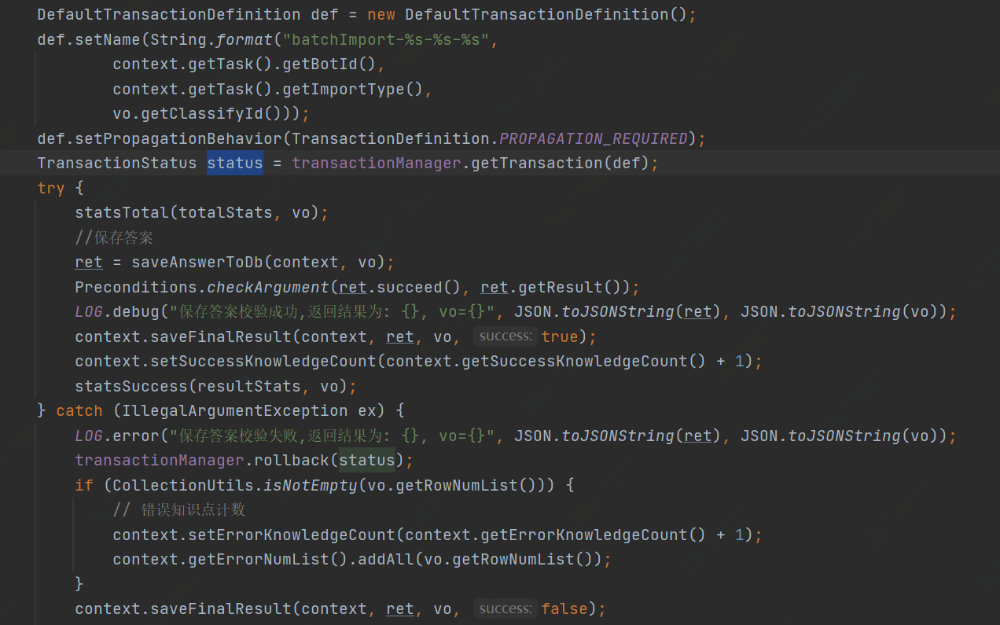

# Day by day

#### 0210

* 架构设计/OOD
  [link](https://segmentfault.com/a/1190000023122582)

#### 0216

* 幂等服务
  以SQL为例，有下面三种场景，只有第三种场景需要开发人员使用其他策略保证幂等性：
  1、 SELECT col1 FROM tab1 WHER col2=2，无论执行多少次都不会改变状态，是天然的幂等。
  2、 UPDATE tab1 SET col1=1WHERE col2=2，无论执行成功多少次状态都是一致的，因此也是幂等操作。
  3、 UPDATE tab1 SET col1=col1+1WHERE col2=2，每次执行的结果都会发生变化，这种不是幂等的。
  [link](https://cloud.tencent.com/developer/article/1522973)

#### 0217

* java双亲委派
  所谓的双亲委派机制，指的就是：当一个类加载器收到了类加载的请求的时候，他不会直接去加载指定的类，而是把这个请求委托给自己的父加载器去加载。只有父加载器无法加载这个类的时候，才会由当前这个加载器来负责类的加载。
* java8的新特性
| 特性                                                                              | 内容                                                                                                                                     |
  | :-------------------------------------------------------------------------------- | :--------------------------------------------------------------------------------------------------------------------------------------- |
  | [Lambda 表达式](https://www.runoob.com/java/java8-lambda-expressions.html)           | Lambda 允许把函数作为一个方法的参数（函数作为参数传递进方法中）。                                                                        |
  | [方法引用](https://www.runoob.com/java/java8-method-references.html)                 | 方法引用通过方法的名字来指向一个方法。方法引用使用一对冒号 :: 。                                                                         |
  | [函数式接口](https://www.runoob.com/java/java8-functional-interfaces.html)           | 函数式接口(Functional Interface)就是一个有且仅有一个抽象方法，但是可以有多个非抽象方法的接口。函数式接口可以被隐式转换为 lambda 表达式。 |
  | [默认方法](https://www.runoob.com/java/java8-default-methods.html)                   |                                                                                                                                          |
  | [Stream](https://www.runoob.com/java/java8-streams.html)                             |                                                                                                                                          |
  | [Optional 类](https://www.runoob.com/java/java8-optional-class.html)                 |                                                                                                                                          |
  | [Nashorn JavaScript 引擎](https://www.runoob.com/java/java8-nashorn-javascript.html) |                                                                                                                                          |
  | [新的日期时间 API](https://www.runoob.com/java/java8-datetime-api.html)              |                                                                                                                                          |
  | [Base64](https://www.runoob.com/java/java8-base64.html)                              |                                                                                                                                          |
* spring bean加载顺序

#### 0221

* InheritableThreadLocal
  InheritableThreadLocal主要用于子线程创建时，需要自动继承父线程的ThreadLocal变量，方便必要信息的进一步传递。
  [link](https://www.jianshu.com/p/94ba4a918ff5)
  ~~* ThreadLocal~~
  ~~[link](http://www.jasongj.com/java/threadlocal/)~~

#### 0222

* String.format()

```
str=String.format("Hi,%s:%s.%s", "王南","王力","王张");
// Hi,王南:王力.王张
```

[link](https://blog.csdn.net/lonely_fireworks/article/details/7962171)

#### 0224

* BigDecima
  Java在java.math包中提供的API类BigDecimal，用来对超过16位有效位的数进行精确的运算。双精度浮点型变量double可以处理16位有效数，但在实际应用中，可能需要对更大或者更小的数进行运算和处理。一般情况下，对于那些不需要准确计算精度的数字，我们可以直接使用Float和Double处理，但是Double.valueOf(String) 和Float.valueOf(String)会丢失精度。所以开发中，如果我们需要精确计算的结果，则必须使用BigDecimal类来操作。
  [link](https://www.cnblogs.com/zhangyinhua/p/11545305.html)
* Redis中String类型的Value最大可以容纳数据长度
  项目中使用redis存储，key-value方式，在Redis中字符串类型的Value最多可以容纳的数据长度是512M
  官方信息:
  A String value can be at max 512 Megabytes in length.
  [link](https://blog.csdn.net/lu_wei_wei/article/details/50906101)

#### 0225

* Mockito 框架
* implements Serializable
  一个对象序列化的接口，一个类只有实现了Serializable接口，它的对象才是可序列化的。因此如果要序列化某些类的对象，这些类就必须实现Serializable接口。而实际上，Serializable是一个空接口，没有什么具体内容，它的目的只是简单的标识一个类的对象可以被序列化.
  在进行Java的Socket编程的时候，你有时候可能要传输某一类的对象，那么也就要实现Serializable接口。最常见的你传输一个字符串，它是JDK里面的类，也实现了Serializable接口，这样做为的是将数据变为**二进制**来传输，所以可以在网络上传输。
  [link](https://blog.csdn.net/am540/article/details/82498298)
  实现将序列化的对象存储到文件，然后再将其从文件中反序列化为对象。没有实现Serializable接口的对象是无法通过IO操作持久化的。
  [link](https://www.cnblogs.com/ciweiyu/articles/13671651.html)!!!重要
* redis过期键的删除策略
  redis使用的过期键值删除策略是：惰性删除加上定期删除，两者配合使用
  [link](https://www.jianshu.com/p/9352d20fb2e0)

#### 0228

* 序列化 反序列化
  将人类语言翻译为计算机存储的语言的过程就是序列化，反之则为反序列化。
  
  序列化的目的
  计算机内部传递文件，数据和信息的过程就是序列化、发送、反序列化的过程。
  
  现实世界中你发送的消息、文件最终都是以机器语言也就是二进制码发送给另外一台电脑然后再反序列化后完成的，这便是网络传输的意义所在。与之对应的另外一种场景，本地存储也是需要序列化的。
  Note：**凡是离开内存的信息都是需要进行序列化的。**
  什么时候需要序列化？
  把内存中的对象保存到一个文件中或者数据库中时候；
  用套接字在网络上传送对象的时候；
  通过RMI传输对象的时候；
  [link](https://blog.csdn.net/vince_hui/article/details/105247134)
* @Resource
  @Resource用法与@Autowired 用法 用法相似，也是做依赖注入的，从容器中自动获取bean。
  在启动spring的时候，首先要启动容器；
  启动spring容器时，会默认寻找容器扫描范围内的可加载bean，然后查找哪些bean上的属性和方法上有@Resource注解；
  找到@Resource注解后，判断@Resource注解括号中的name属性是否为空，如果为空：看spring容器中的bean的id与@Resource要注解的那个变量属性名是否相同，如相同，匹配成功；如果不相同，看spring容器中bean的id对应的类型是否与@Resource要注解的那个变量属性对应的类型是否相等，若相等，匹配成功，若不相等，匹配失败。
  如果@Resource注解括号中的name属性不为空，看name的属性值和容器中的bean的id名是否相等，如相等，则匹配成功；如不相等，则匹配失败。
  [link](https://blog.csdn.net/u010502101/article/details/78950045)
* WebSocket
  WebSocket协议是基于TCP的一种新的网络协议。它实现了浏览器与服务器全双工(full-duplex)通信——允许服务器主动发送信息给客户端。
  [link](https://www.helloworld.net/p/4778073982)
* java内存分析
  java内存分析工具 jmap，jhat及dump分析
  [link](https://www.jianshu.com/p/1b1c998c4448)
* try catch finally
  不管try有没有出错finally方法块都会被执行。
  就算try和catch方法都有return，finally都会执行；
  只要try或者catch return返回，try catch 之外的return都无效；
  那在finally写个return是什么结果哪？写了会不能离开finally子句主体；
  [link](https://www.cnblogs.com/yanbigfeg/p/9295541.html)

#### 0301

* instanceof
  [link](https://www.jianshu.com/p/5fc7d8cc0cf0)
* HTTP请求状态码
  
  | HTTP 返回码（Status Code）                                             | 说明（Description）                                                  |
  | :--------------------------------------------------------------------- | :------------------------------------------------------------------- |
  | 400                                                                    | 错误请求）服务器不理解请求的语法。                                   |
  | 404                                                                    | （未找到）服务器找不到请求的接口。                                   |
  | 500                                                                    | （服务器内部错误）服务器遇到错误，无法完成请求。                     |
  | 504                                                                    | （网关超时）服务器作为网关或代理，但是没有及时从上游服务器收到请求。 |
  | [link](https://docs-im.easemob.com/start/450errorcode/10restapierrorcode) |                                                                      |
* git提交规范

> feat - 新功能 feature
> fix - 修复 bug
> docs - 文档注释
> style - 代码格式(不影响代码运行的变动)
> refactor - 重构、优化(既不增加新功能，也不是修复bug)
> perf - 性能优化
> test - 增加测试
> chore - 构建过程或辅助工具的变动
> revert - 回退
> build - 打包
> [link](https://juejin.cn/post/6844903793033756680#heading-6)

#### 0302

* redis中hash类型操作
  [link](https://segmentfault.com/a/1190000037786578)
* java JSONObject
  构造JSONObject

```
JSONObject();
JSONObject(String str);
JSONObject(Object obj);
JSONObject(Map<String, Object> map);
```

无参构造JSONObject

```
People people = new People();
...省略
JSONObject jsonO = new JSONObject();
jsonO.put("a", "a");
jsonO.put("people", people);
System.out.println(jsonO);
```

[link](https://blog.csdn.net/Qimingweikun/article/details/79970180)

* spring context
* java.lang.reflect.Field
  [link](https://vimsky.com/examples/usage/field-set-method-in-java-with-examples.html)
  [link](https://www.cnblogs.com/Big-Boss/p/13402721.html)

#### 0303

* toString和toJSONString的区别

```
 Map<String, Integer> map = new HashMap<>();
map.put( "staff9", 1 );
map.put( "staff1", 3 );
System.out.println(map.toString());
System.out.println(JSONObject.toJSONString(map));

List<Map<String, Integer>> list = new ArrayList<>();
list.add(map);
System.out.println(list.toString());
System.out.println(JSONArray.toJSONString(list));
<!-- 结果
{staff9=1, staff1=3}
{"staff9":1,"staff1":3}
[{staff9=1, staff1=3}]
[{"staff9":1,"staff1":3}] -->
```

[link](https://blog.csdn.net/sinat_36454672/article/details/105969975)

#### 0304

* redis支持数据类型及用法
  字符串 done
  哈希 done
  列表 done
  集合 done
  有序集合
  HyperLogLog
  [link](https://www.redis.com.cn/redis-intro.html) **还要很多没有看**
* HTTP和RPC的区别

#### 0307

* BeanMap.create()
  进行对象与Map的相互转换
  [link](https://blog.csdn.net/q358543781/article/details/50176953)
* equals() equalsIgnoreCase()
  For e.g. The equals() method would return false if we compare the strings “TEXT” and “text” however equalsIgnoreCase() would return true.
  [link](https://beginnersbook.com/2013/12/java-string-equals-and-equalsignorecase-methods-example/)
* 拦截器
  Spring的拦截器

```
public abstract class HandlerInterceptorAdapter implements HandlerInterceptor{
    // 在业务处理器处理请求之前被调用
    public boolean preHandle(HttpServletRequest request, HttpServletResponse response, Object handler) throws Exception{
        return true;
    }
    // 在业务处理器处理请求完成之后，生成视图之前执行
    public void postHandle(HttpServletRequest request, HttpServletResponse response, Object handler, ModelAndView modelAndView)
      throws Exception{
    }
    // 在DispatcherServlet完全处理完请求之后被调用，可用于清理资源
    public void afterCompletion(HttpServletRequest request, HttpServletResponse response, Object handler, Exception ex)
      throws Exception{
    }
}
```

[link](https://segmentfault.com/a/1190000024464165)
Struts2的拦截器
[link](https://www.jianshu.com/p/30b62f11d6cb)

* 跨域

| 参数                             | 值           | 描述                                                 |
  | :------------------------------- | :----------- | :--------------------------------------------------- |
  | Access-Control-Allow-Origin      | *            | 授权的源控制                                         |
  | Access-Control-Allow-Credentials | true / false | 是否允许用户发送和处理cookie                         |
  | Access-Control-Allow-Methods     | [,]*         | 允许请求的HTTP Method，多个用逗号分隔                |
  | Access-Control-Allow-Headers     | [,]*         | 控制哪些header能发送真正的请求，多个用逗号分隔       |
  | Access-Control-Max-Age           | 秒           | 授权的时间，单位为秒。有效期内，不会重复发送预检请求 |

当发生跨域请求时，浏览器会发起两次请求，第一次为预检请求，其请求方法为OPTIONS，第二次为真实请求。只有当第一次请求成功后才会发起第二次请求。
所以在拦截器或者过滤器对token进行验证的时候处理，OPTIONS的请求是不会带有认证信息，所以需要跳过OPTIONS请求。

```
String method = request.getMethod();
if(method.equals("OPTIONS")){
  // 放行
} else {
  // 验证token
}
```


[link](https://segmentfault.com/a/1190000017823645)

#### 0309

* @PostConstruct注解
  该注解是Java jdk提供的注解，而不是Spring框架提供的， JavaEE5引入了@PostConstruct和@PreDestroy两个作用于Servlet生命周期的注解，实现Bean初始化之前和销毁之前的自定义操作。
  Constructor(构造方法) -> @Autowired(依赖注入) -> @PostConstruct(注释的初始化方法)

```
import javax.annotation.PostConstruct;
 
@Component
public class Utils {
 
    @Autowired
    private UserService userService;
 
    @PostConstruct
    void init() {
        userService.doSomething();  //userService注入后执行一些初始化操作
    }
 
}
```

[link](https://blog.csdn.net/skh2015java/article/details/117751380)

* ConcurrentHashMap
JDK1.8 ConcurrentHashMap取消了segment分段锁，而采用CAS和synchronized来保证并发安全。数据结构采用数组+链表/红黑二叉树。
ConcurrentHashMap是jdk的并发包中提供的并发map，可以有效防止多线程操作一个对象时出现对象副本不一致。
另外ConcurrentHashMap在多线程的情况下,也是一般用在**读多写少**的情况.不是所有的多线程都可以使用这个并发工具类的
[link](https://segmentfault.com/q/1010000009944819)
* ThreadLocal
ThreadLocal 适用于每个线程需要自己独立的实例且该实例需要在多个方法中被使用，也即变量在线程间隔离而在方法或类间共享的场景。
ThreadLocal 适用于如下两种场景
每个线程需要有自己单独的实例
实例需要在多个方法中共享，但不希望被多线程共享
[link](http://www.jasongj.com/java/threadlocal/)

#### 0311
* 并发队列ConcurrentLinkedQueue、阻塞队列AraayBlockingQueue、阻塞队列LinkedBlockingQueue 区别和使用场景总结
三者区别与联系：联系，三者都是线程安全的。区别就是并发和阻塞，前者为并发队列，由于采用cas算法，因此可以高并发的处理；后2者采用锁机制，因此是阻塞的。
单生产者，单消费者  用 LinkedBlockingqueue  
多生产者，单消费者   用 LinkedBlockingqueue  
单生产者 ，多消费者   用 ConcurrentLinkedQueue
多生产者 ，多消费者   用 ConcurrentLinkedQueue
[link](https://juejin.cn/post/6844903602427805704)很细节但是看不下去。。

#### 0314
* HashMap(int initialCapacity)初始化
hashMap源码中initialCapacity的初始值为16，负载因子为0.75；
所以一个hashMap中默认存储长度为16 * 0.75 = 12，也就是如果hashMap.put的键值对数量小于12的时候，hashMap位置够用；但是当添加的键值对数超过12后，hashMap需要扩容，一倍，也就是长度从12扩容到24；
例如键值对一共13个，这样剩余11个位置性能都浪费了，那么如果已知需要添加的键值对数量，就可以通过设置initialMap的值，来避免hashMap扩容，减少性能消耗。
eg：我们需要往hashMap中添加6个键值对，6 / 0.75 = 8；那就可以把initialCapacity设置为9比较合适，节省性能。
```
Map<String, Object> resultMap =  new HashMap<String, Object>(initialCapacity: 5);
```
[link](https://blog.csdn.net/wx1528159409/article/details/102627469)

* Map.Entry详解 
```
Map<String, String> map = new HashMap<String, String>();    
map.put("key1", "value1");    
map.put("key2", "value2");    
map.put("key3", "value3"); 
System.out.println("通过Map.entrySet遍历key和value");    
for (Map.Entry<String, String> entry : map.entrySet()) {    
 System.out.println("key= " + entry.getKey() + " and value= " + entry.getValue());    
} 
```
[link](https://blog.csdn.net/yaomingyang/article/details/78748130)
* InitializingBean的作用
1：spring为bean提供了两种初始化bean的方式，实现InitializingBean接口，实现afterPropertiesSet方法，或者在配置文件中同过init-method指定，两种方式可以同时使用
2：实现InitializingBean接口是直接调用afterPropertiesSet方法，比通过反射调用init-method指定的方法效率相对来说要高点。但是init-method方式消除了对spring的依赖
3：如果调用afterPropertiesSet方法时出错，则不调用init-method指定的方法。
4：TransactionTemplate实现InitializingBean接口，主要是判断transactionManager是否已经初始化，如果没有则抛出异常。
[link](https://blog.csdn.net/maclaren001/article/details/37039749)
* ScheduledExecutorService定时周期执行指定的任务
java.util.concurrent.ScheduleExecutorService extends ExecutorService extends Executor
command：执行线程
initialDelay：初始化延时
period：两次开始执行最小间隔时间
unit：计时单位
```
 public ScheduledFuture<?> scheduleAtFixedRate(Runnable command,
				long initialDelay,
				long period,
				TimeUnit unit);
```
command：执行线程
initialDelay：初始化延时
period：前一次执行结束到下一次执行开始的间隔时间（间隔执行延迟时间）
unit：计时单位
```
public ScheduledFuture<?> scheduleWithFixedDelay(Runnable command,
				long initialDelay,
				long delay,
				TimeUnit unit);
```
[link](https://blog.csdn.net/tsyj810883979/article/details/8481621)

#### 0418
* java反射-获得泛型参数
```
public class Person<T> {

}

import java.lang.reflect.ParameterizedType;
import java.lang.reflect.Type;

public class Student extends Person<Student> {
    public static void main(String[] args) {
        Student st = new Student();
        Class clazz = st.getClass();
        // getSuperclass()获得该类的父类
        System.out.println(clazz.getSuperclass());
        // getGenericSuperclass()获得带有泛型的父类
        // Type是 Java 编程语言中所有类型的公共高级接口。它们包括原始类型、参数化类型、数组类型、类型变量和基本类型。
        Type type = clazz.getGenericSuperclass();
        System.out.println(type);
        // ParameterizedType参数化类型，即泛型
        ParameterizedType p = (ParameterizedType) type;
        // getActualTypeArguments获取参数化类型的数组，泛型可能有多个
        Class c = (Class) p.getActualTypeArguments()[0];
        System.out.println(c);
    }
}

// 打印结果：

// class com.test.Person
// com.test.Person<com.test.Student>
// class com.test.Student
```
[link](https://blog.csdn.net/liang5630/article/details/40185591)

* java注解&反射
1. 注解部分
针对类
```
@Target(ElementType.TYPE)
@Retention(RetentionPolicy.RUNTIME)
public @interface Table {

    String name();
}
```
针对属性
```
@Target(ElementType.FIELD)
@Retention(RetentionPolicy.RUNTIME)
public @interface Column {

    boolean id() default false;
    String name() default "";
}
```
2. 将注解应用于实体类
```
@Table(name = "developer")
public class Developer {

    @Column(id = true, name = "_id")
    private String id;
    @Column(name = "_name")
    private String name;

    public String getId() {
        return id;
    }

    public void setId(String id) {
        this.id = id;
    }

    public String getName() {
        return name;
    }

    public void setName(String name) {
        this.name = name;
    }
}
```
3. 测试（通过反射读取数据）
```
public class Test {

    public static void main(String[] args) throws IllegalAccessException {

        Developer developer = new Developer();
        developer.setId("id_1001");
        developer.setName("Jack");

        Class<?> clz = Developer.class;

        //检查是否有注解
        if (clz.isAnnotationPresent(Table.class)) {
            Table table = clz.getAnnotation(Table.class);
            System.err.println("clz_name: " + clz.getSimpleName() + "; table_name: " + table.name());

            Field[] fields = clz.getDeclaredFields();
            for (Field field : fields) {
                if (field.isAnnotationPresent(Column.class)) {
                    Column column = field.getAnnotation(Column.class);
                    field.setAccessible(true);
                    System.err.println(clz.getSimpleName() + "." + field.getName() + "---"
                            + table.name() + "." + column.name() + ":" + field.get(developer).toString());

                    //测试id
                    if(column.id()) {
                        System.err.println("when id, out put this");
                    }
                } else {
                    System.err.println(clz.getSimpleName() + "." + field.getName() + " not ...");
                }
            }
        } else {
            System.out.println("clz " + clz.getSimpleName() + " has no annotation.");
        }

    }
}

//输出打印
clz_name: Developer; table_name: developer
Developer.id---developer._id:id_1001
when id, out put this
Developer.name---developer._name:Jack
```

[link](https://www.programminghunter.com/article/31022140954/)

* java反射-获取类的字段
getFields(): 获取某个类的所有的public字段，其中是包括父类的public字段的。
getDeclaredFields()：获取某个类的自身的所有字段，不包括父类的字段。
[link](https://blog.csdn.net/liujun03/article/details/81512834)

* Method.invoke
public Object invoke(Object obj, Object… args)
第一个参数为类的实例，第二个参数为相应函数中的参数
参数：
obj：从中调用底层方法的对象，必须是实例化对象
args： 用于方法的调用，是一个object的数组，参数有可能是多个
```
Class c = Class.forName("com.cmcc.test.Student");
Object obj = c.newInstance();
Method method = c.getMethod("setNum", Integer.class);
method.invoke(obj, 1);
```
[link](https://blog.csdn.net/ChineseProgrammers/article/details/72675287)

* java类的字段设置默认值
工厂模式
```
public class StudentBuilder
{
    private String _name;
    private int _age = 14;      // this has a default
    private String _motto = ""; // most students don't have one

    public StudentBuilder() { }

    public Student buildStudent()
    {
        return new Student(_name, _age, _motto);
    }

    public StudentBuilder name(String _name)
    {
        this._name = _name;
        return this;
    }

    public StudentBuilder age(int _age)
    {
        this._age = _age;
        return this;
    }

    public StudentBuilder motto(String _motto)
    {
        this._motto = _motto;
        return this;
    }
}
```
使用如下：
```
Student s1 = new StudentBuilder().name("Eli").buildStudent();
Student s2 = new StudentBuilder()
                 .name("Spicoli")
                 .age(16)
                 .motto("Aloha, Mr Hand")
                 .buildStudent();
```
[link](https://segmentfault.com/a/1190000018605171)

* java过滤-Predicate
根据对象的某个属性过滤list
```
        Predicate<Person> strFilter = (aa) -> (aa.getId() > 1);
        List<Person> dd  = new ArrayList<>();
        list.stream()
            .filter(strFilter)
            .forEach((strlist) -> dd.add(strlist));
            //dd的对象的id字段都大于1
```
[link](https://blog.csdn.net/qq_35462323/article/details/90241798)
多条件过滤，复杂过滤
[link](https://blog.csdn.net/w605283073/article/details/89410918)

* spring事务-TransactionDefinition接口
1. 其核心PlatformTransactionManager.getTransaction()方法将TransactionDefinition接口作为参数，并返回TransactionStatus接口
2. TransactionStatus接口用于控制事务执行，即设置事务结果、检查事务是否完成或是否为新事务

**事务隔离级别**
|隔离级别|描述|
|:-|:-|
|ISOLATION_DEFAULT	|底层存储的默认隔离级别|
|ISOLATION_READ_UNCOMMITTED	|RU：最低级隔离级别。它几乎不是事务，允许查看一个事务未提交事务修改的数据；|
|ISOLATION_READ_COMMITTED	|RC：大多数数据库的默认级别。不可以读取未提交事务的数据，一但提交其他事务就可以操作改数据；|
|ISOLATION_REPEATABLE_READ	|RR：比RC级别更严格，确保一个事务的重复读取数据都是一致的，不能避免‘幻读’|
|ISOLATION_SERIALIZABLE|	S：最严格的级别，所有事务排队执行；(数据操作最安全，性能最差的一个)|

**事务传播类型**
|传播类型|描述|
|:-|:-|
|PROPAGATION_REQUIRED	|支持一个已经存在的事务。如果没有事务，则开始一个新的事务；|
|PROPAGATION_SUPPORTS	|支持一个已经存在的事务。如果没有事务，则以非事务方式运行；|
|PROPAGATION_MANDATORY|	支持一个已经存在的事务。如果没有活动事务，则抛异常；|
|PROPAGATION_REQUIRES_NEW	|始终开始新事务。如果活动事物已经存在，将其暂停；|
|PROPAGATION_NOT_SUPPORTED|	不支持活动事务的执行。始终以非事务方式执行，并暂停任何现有事务；|
|PROPAGATION_NEVER|	即使存在活动事务，也始终以非事务方式执行。如果存在活动事物，抛出异常；|
|PROPAGATION_NESTED	|如果存在活动事务，则在嵌套事务中运行。如果没有活动事务，则与PROPAGATION_REQUIRED相同；|


[link](https://blog.csdn.net/u014259503/article/details/94383010)

* spring事务-@Transactional(rollbackFor = Exception.class)
spring支持编程式事务管理和声明式事务管理两种方式。
编程式事务管理使用TransactionTemplate或者直接使用底层的PlatformTransactionManager。对于编程式事务管理，spring推荐使用TransactionTemplate。
声明式事务管理建立在AOP之上的。其本质是对方法前后进行拦截，然后在目标方法开始之前创建或者加入一个事务，在执行完目标方法之后根据执行情况提交或者回滚事务。
声明式事务管理也有两种常用的方式，一种是基于tx和aop名字空间的xml配置文件，另一种就是基于@Transactional注解。显然基于注解的方式更简单易用，更清爽。
[link](https://www.cnblogs.com/clwydjgs/p/9317849.html)

* mysql-同时update和select同一张表
mysql在from子句中遇到子查询时，先执行子查询并将结果放到一个临时表中，我们通常称它为“派生表”；临时表是没有索引、无法加锁的。
[link](https://blog.csdn.net/u013344884/article/details/79571101)